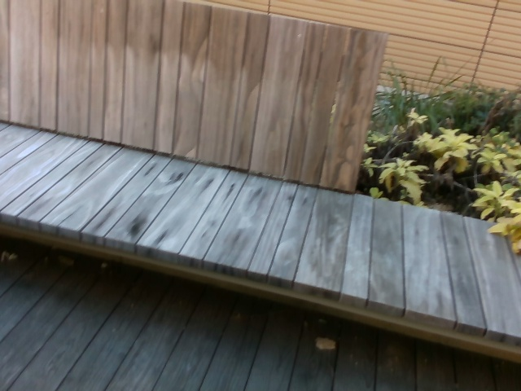
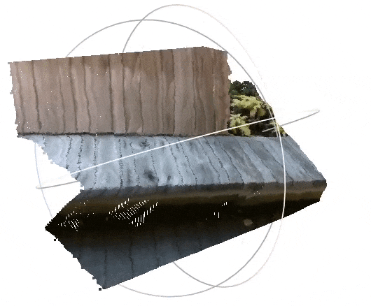
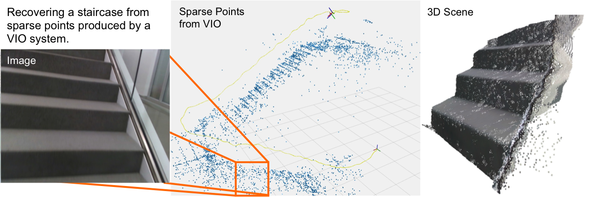

# Unsupervised Depth Completion from Visual Inertial Odometry
Project **VOICED**: **De**pth **C**ompletion from **I**nertial **O**dometry and **V**ision

Tensorflow and PyTorch implementations of *Unsupervised Depth Completion from Visual Inertial Odometry*

Published in RA-L January 2020 and ICRA 2020

[[arxiv]](https://arxiv.org/pdf/1905.08616.pdf) [[poster]]() [[talk]](https://www.youtube.com/watch?v=oBCKO4TH5y0)

Tensorflow models have been tested on Ubuntu 16.04 using Python 3.5, 3.6 Tensorflow 1.14, 1.15 on CUDA 10.0

PyTorch models have been tested on Ubuntu 20.04 using Python 3.7, 3.8 PyTorch 1.10 on CUDA 11.1

Authors: [Alex Wong](http://vision.cs.yale.edu/members/alex-wong.html), [Xiaohan Fei](https://feixh.github.io/), Stephanie Tsuei

If you use this work, please cite our paper:
```
@article{wong2020unsupervised,
 title={Unsupervised Depth Completion From Visual Inertial Odometry},
  author={Wong, Alex and Fei, Xiaohan and Tsuei, Stephanie and Soatto, Stefano},
  journal={IEEE Robotics and Automation Letters},
  volume={5},
  number={2},
  pages={1899--1906},
  year={2020},
  publisher={IEEE}
}
```

### Looking our latest work in unsupervised depth completion?

Check out our RAL 2021 and ICRA 2021 paper, [ScaffNet][scaffnet_github]: *Learning Topology from Synthetic Data for Unsupervised Depth Completion*

[ScaffNet][scaffnet_github] is trained on synthetic data (SceneNet), but is able to generalize to novel real data (VOID and NYUv2)!

Also, our ICCV 2021 oral paper, [KBNet][kbnet_github]: *Unsupervised Depth Completion with Calibrated Backprojection Layers*

[KBNet][kbnet_github] runs at 15 ms/frame (67 fps) and improves over VOICED by 51.7% on indoors (VOID) and 13.7% on outdoors (KITTI)!

### Table of Contents
1. [About sparse-to-dense depth completion](#about-sparse-to-dense)
2. [About VOICED](#about-voiced)
3. [Setting up for Tensorflow implementation](#setting-up-tensorflow)
4. [Setting up for PyTorch implementation](#setting-up-pytorch)
5. [Related projects](#related-projects)
6. [License and disclaimer](#license-disclaimer)

## About sparse-to-dense depth completion <a name="about-sparse-to-dense"></a>
In the sparse-to-dense depth completion problem, we seek to infer the dense depth map of a 3-D scene using an RGB image and its associated sparse depth measurements in the form of a sparse depth map, obtained either from computational methods such as SfM (Strcuture-from-Motion) or active sensors such as lidar or structured light sensors.

| *Input RGB image from the VOID dataset*    | *Densified depth map -- colored and back-projected to 3-D* |
| :----------------------------------------: | :--------------------------------------------------------: |
|  |  |

| *Input RGB image from the KITTI dataset*    | *Densified depth map -- colored and back-projected to 3-D* |
| :-----------------------------------------: | :--------------------------------------------------------: |
|  |  |

To follow the literature and benchmarks for this task, you may visit:
[Awesome State of Depth Completion](https://github.com/alexklwong/awesome-state-of-depth-completion)

## About VOICED <a name="about-voiced"></a>
VOICED is an unsupervised depth completion method that is built on top of [XIVO][xivo_github]. Unlike previous methods, we build a scaffolding of the scene using the sparse depth measurements (~5% density for outdoors driving scenarios like KITTI and ~0.5% to ~0.05% for indoors scenes like VOID) and refines the scaffolding using a light-weight network.

<p align="center">

</p>

This paradigm allows us to achieve the state-of-the-art on the unsupervised depth completion task while reducing parameters by as much as 80% compared to prior-arts. As an added bonus, our approach does not require top of the line GPUs (e.g. Tesla V100, Titan V) and can be deployed on much cheaper hardware.

## Setting up for Tensorflow implementation <a name="setting-up-tensorflow"></a>
For the original Tensorflow implementation that was used in *Unsupervised Depth Completion from Visual Inertial Odometry*, please visit [VOICED Tensorflow](tensorflow/README.md). Note that the Tensorflow implementation is written for Tensorflow 1 and not 2. We will stop support on Tensorflow 1 version starting on this commit. We currently do not have plans to support Tensorflow 2, but may revisit this in the future if there is enough interest in that platform. For those who are interested in future versions of this work, we encourage you to use the PyTorch version (see below).

Note: Dataset set up and data handling of Tensorflow version follows the original version of the code. To ensure that the code works properly, please treat the `tensorflow` directory as the root of the Tensorflow code repository.

## Setting up for PyTorch implementation <a name="setting-up-pytorch"></a>
We have released a PyTorch re-implementation of *Unsupervised Depth Completion from Visual Inertial Odometry*. Although hyper-parameters may different, the implementation is faithful to the original -- the necessary change to reproduce the results may be due to subtle differences between Tensorflow and PyTorch platforms. Please see [VOICED PyTorch](pytorch/README.md) for more source code and instructions. As our group have migrated to PyTorch as the main platform, we will continue to support this re-implementation, but will discontinue support for Tensorflow.

Note: The PyTorch version follows the implementation pattern in [KBNet][kbnet_github] and [MonDi][mondi_github] and hence dataset (KITTI, VOID) setup and data loading functions will differ from the Tensorflow version. To ensure that the code works properly, please treat the `pytorch` directory as the root of the PyTorch code repository.

**Coming soon!** We will release pre-trained models for the PyTorch re-implementation in the upcoming months, stay tuned!

## Related projects <a name="related-projects"></a>
You may also find the following projects useful:

- [MonDi][mondi_github]: *Monitored Distillation for Positive Congruent Depth Completion (MonDi)*. A method for blind ensemble distillation that leverages a monitoring validation function to allow student models trained through the distillation process to retain strengths of teachers while minimizing distillation of their weaknesses. This work is published in the European Conference on Computer Vision (ECCV) 2022.
- [KBNet][kbnet_github]: *Unsupervised Depth Completion with Calibrated Backprojection Layers*. A fast (15 ms/frame) and accurate unsupervised sparse-to-dense depth completion method that introduces a calibrated backprojection layer that improves generalization across sensor platforms. This work is published as an *oral* paper in the International Conference on Computer Vision (ICCV) 2021.
- [ScaffNet][scaffnet_github]: *Learning Topology from Synthetic Data for Unsupervised Depth Completion*. An unsupervised sparse-to-dense depth completion method that first learns a map from sparse geometry to an initial dense topology from synthetic data (where ground truth comes for free) and amends the initial estimation by validating against the image. This work is published in the Robotics and Automation Letters (RA-L) 2021 and the International Conference on Robotics and Automation (ICRA) 2021.
- [AdaFrame][adaframe_github]: *Learning Topology from Synthetic Data for Unsupervised Depth Completion*. An adaptive framework for learning unsupervised sparse-to-dense depth completion that balances data fidelity and regularization objectives based on model performance on the data. This work is published in the Robotics and Automation Letters (RA-L) 2021 and the International Conference on Robotics and Automation (ICRA) 2021.
- [VOICED][voiced_github]: *Unsupervised Depth Completion from Visual Inertial Odometry*. An unsupervised sparse-to-dense depth completion method, developed by the authors. The paper introduces Scaffolding for depth completion and a light-weight network to refine it. This work is published in the Robotics and Automation Letters (RA-L) 2020 and the International Conference on Robotics and Automation (ICRA) 2020.
- [VOID][void_github]: from *Unsupervised Depth Completion from Visual Inertial Odometry*. A dataset, developed by the authors, containing indoor and outdoor scenes with non-trivial 6 degrees of freedom. The dataset is published along with this work in the Robotics and Automation Letters (RA-L) 2020 and the International Conference on Robotics and Automation (ICRA) 2020.
- [XIVO][xivo_github]: The Visual-Inertial Odometry system developed at UCLA Vision Lab. This work is built on top of XIVO. The VOID dataset used by this work also leverages XIVO to obtain sparse points and camera poses.
- [GeoSup][geosup_github]: *Geo-Supervised Visual Depth Prediction*. A single image depth prediction method developed by the authors, published in the Robotics and Automation Letters (RA-L) 2019 and the International Conference on Robotics and Automation (ICRA) 2019. This work was awarded **Best Paper in Robot Vision** at ICRA 2019.
- [AdaReg][adareg_github]: *Bilateral Cyclic Constraint and Adaptive Regularization for Unsupervised Monocular Depth Prediction.* A single image depth prediction method that introduces adaptive regularization. This work was published in the proceedings of Conference on Computer Vision and Pattern Recognition (CVPR) 2019.

We also have works in adversarial attacks on depth estimation methods and medical image segmentation:
- [SUPs][sups_github]: *Stereoscopic Universal Perturbations across Different Architectures and Datasets..* Universal advesarial perturbations and robust architectures for stereo depth estimation, published in the Proceedings of Computer Vision and Pattern Recognition (CVPR) 2022.
- [Stereopagnosia][stereopagnosia_github]: *Stereopagnosia: Fooling Stereo Networks with Adversarial Perturbations.* Adversarial perturbations for stereo depth estimation, published in the Proceedings of AAAI Conference on Artificial Intelligence (AAAI) 2021.
- [Targeted Attacks for Monodepth][targeted_attacks_monodepth_github]: *Targeted Adversarial Perturbations for Monocular Depth Prediction.* Targeted adversarial perturbations attacks for monocular depth estimation, published in the proceedings of Neural Information Processing Systems (NeurIPS) 2020.
- [SPiN][spin_github] : *Small Lesion Segmentation in Brain MRIs with Subpixel Embedding.* Subpixel architecture for segmenting ischemic stroke brain lesions in MRI images, published in the Proceedings of Medical Image Computing and Computer Assisted Intervention (MICCAI) Brain Lesion Workshop 2021 as an **oral paper**.

[kitti_dataset]: http://www.cvlibs.net/datasets/kitti/
[nyu_v2_dataset]: https://cs.nyu.edu/~silberman/datasets/nyu_depth_v2.html
[void_github]: https://github.com/alexklwong/void-dataset
[voiced_github]: https://github.com/alexklwong/unsupervised-depth-completion-visual-inertial-odometry
[scaffnet_github]: https://github.com/alexklwong/learning-topology-synthetic-data
[adaframe_github]: https://github.com/alexklwong/adaframe-depth-completion
[kbnet_github]: https://github.com/alexklwong/calibrated-backprojection-network
[mondi_github]: https://github.com/alexklwong/mondi-python
[xivo_github]: https://github.com/ucla-vision/xivo
[geosup_github]: https://github.com/feixh/GeoSup
[adareg_github]: https://github.com/alexklwong/adareg-monodispnet
[sups_github]: https://github.com/alexklwong/stereoscopic-universal-perturbations
[stereopagnosia_github]: https://github.com/alexklwong/stereopagnosia
[targeted_attacks_monodepth_github]: https://github.com/alexklwong/targeted-adversarial-perturbations-monocular-depth
[spin_github]: https://github.com/alexklwong/subpixel-embedding-segmentation

## License and disclaimer <a name="license-disclaimer"></a>
This software is property of the UC Regents, and is provided free of charge for research purposes only. It comes with no warranties, expressed or implied, according to these [terms and conditions](license). For commercial use, please contact [UCLA TDG](https://tdg.ucla.edu).
